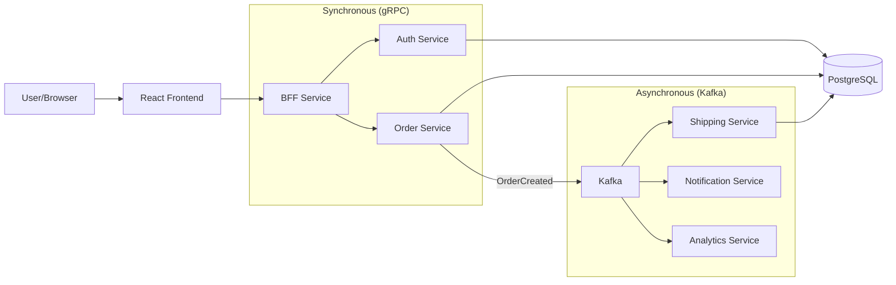

# E-Commerce Distributed System

A modern, distributed e-commerce system built for learning advanced microservices concepts. The system uses **React** (TypeScript) for the frontend, **Go** for backend services, **Kafka** for asynchronous event-driven communication, and runs on **Kubernetes** (Minikube).

## Tech Stack

- **Frontend:** React, TypeScript, Vite, Tailwind CSS
- **Backend (BFF):** Go, HTTP/REST, gRPC Client
- **Microservices:** Go, gRPC Server
  - `Auth`: User registration, JWT authentication (PostgreSQL)
  - `Order`: Order creation and management (PostgreSQL)
  - `Shipping`: Shipment processing (PostgreSQL)
  - `Notification`: Email/Alerts (Kafka Consumer)
  - `Analytics`: Business intelligence (Kafka Consumer)
- **Database:** PostgreSQL (with `pgx` driver)
- **Messaging:** Apache Kafka & Zookeeper
- **Infrastructure:** Kubernetes, Helm, Docker
- **Dev Tooling:** Tilt, pgAdmin
- **GitOps:** ArgoCD (Upcoming)

## Prerequisites

- Go 1.22+
- Node.js 20+ & npm
- Docker & Minikube
- Helm
- **Tilt** (Replacement for Skaffold)
- Protoc (Protocol Buffers Compiler)

## Getting Started

We use **Tilt** for a seamless "Build, Deploy, Watch" workflow with a live dashboard.

### 1. Start Minikube

```bash
minikube start
```

### 2. Configure Secrets (Local Dev)

Create a `local-secrets.yaml` file in the root directory. This file is **ignored by git** for security.

```yaml
apiVersion: v1
kind: Secret
metadata:
  name: my-store-secrets
type: Opaque
stringData:
  postgres-password: "password" # DB Password (default: password)
  jwt-secret: "super-secret-key" # JWT Signing Key
  pgadmin-email: "admin@admin.com" # pgAdmin Login Email
  pgadmin-password: "admin" # pgAdmin Login Password
```

### 3. Run with Tilt

```bash
tilt up
```

- Press `Space` to open the Tilt Dashboard (http://localhost:10350).
- Tilt will build all docker images, deploy the Helm chart, and stream logs.

## Accessing Services

| Service      | URL                   | Description                                       |
| :----------- | :-------------------- | :------------------------------------------------ |
| **Frontend** | http://localhost:3000 | React Web App                                     |
| **BFF API**  | http://localhost:8080 | Backend for Frontend API                          |
| **pgAdmin**  | http://localhost:5050 | Database GUI (Login: `admin@admin.com` / `admin`) |

## Development Workflow

### Regenerate Protobufs

If you modify any `.proto` files:

```bash
# Using Docker (Recommended - no local protoc needed)
docker run --rm -v "${PWD}:/app" -w /app golang:alpine sh -c "apk add --no-cache protobuf-dev protoc && go install google.golang.org/protobuf/cmd/protoc-gen-go@latest && go install google.golang.org/grpc/cmd/protoc-gen-go-grpc@latest && protoc --go_out=pkg/api/auth --go_opt=paths=source_relative --go-grpc_out=pkg/api/auth --go-grpc_opt=paths=source_relative -I proto proto/auth.proto && protoc --go_out=pkg/api/order --go_opt=paths=source_relative --go-grpc_out=pkg/api/order --go-grpc_opt=paths=source_relative -I proto proto/order.proto && protoc --go_out=pkg/api/shipping --go_opt=paths=source_relative --go-grpc_out=pkg/api/shipping --go-grpc_opt=paths=source_relative -I proto proto/shipping.proto"
```

### Database Access

Use **pgAdmin** (http://localhost:5050) to inspect databases.

- **Host:** `postgres`
- **User:** `user`
- **Password:** `password` (or whatever you set in secrets)
- **Databases:** `auth_db`, `order_db`, `shipping_db`

## GitOps & ArgoCD (Upcoming)

We plan to implement **GitOps** principles using ArgoCD.

### How it will work:

1.  **Source of Truth:** This GitHub repository will hold the Helm charts (`deploy/helm/my-store`) and application manifests.
2.  **ArgoCD:** Will run inside the Kubernetes cluster.
3.  **Sync:** ArgoCD will monitor this repo. When you push a change to `main`, ArgoCD will detect the difference and automatically sync (deploy) the changes to the cluster.
4.  **Secrets:** In production, secrets will likely be managed via **Sealed Secrets** or **External Secrets Operator**, committing encrypted secrets to git that only the cluster can decrypt.

## Architecture (Simplified)


